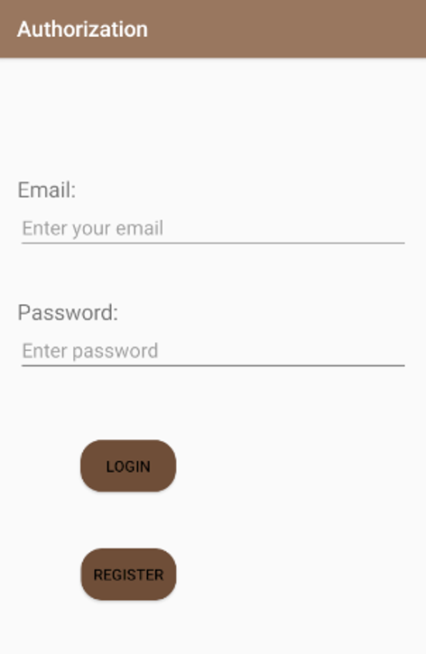
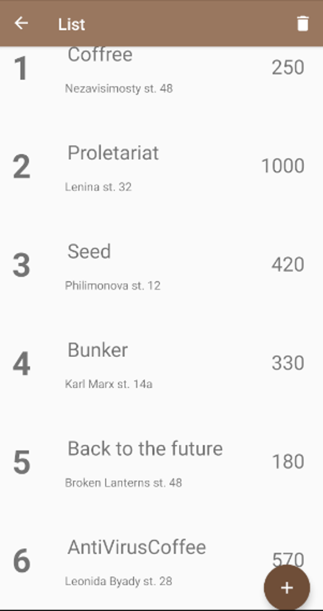
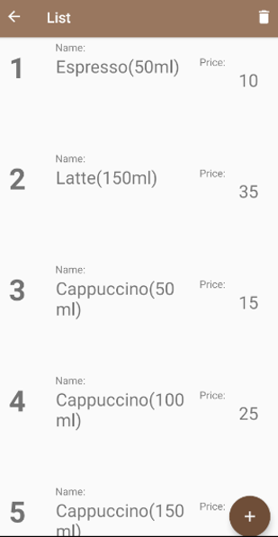
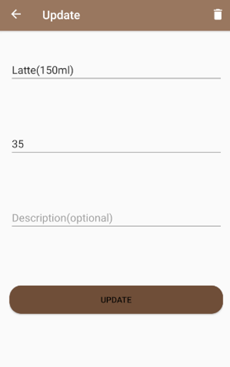

# Coffree
Coffree is an app for corporate use.
Realizes authorization for employees with different access leve and database for storing employee and coffee chain company data ( profit, assortment etc.)

This app uses following stack of technologies:
* Room library for storing data
* Navigation component
* MVVM architecture model
* Single activity
* Kotlin coroutines

## Authorization

## Coffee list realization

## Assortment list realization

screenshots/update_assortment_scrn.png

## Assortment update realization

